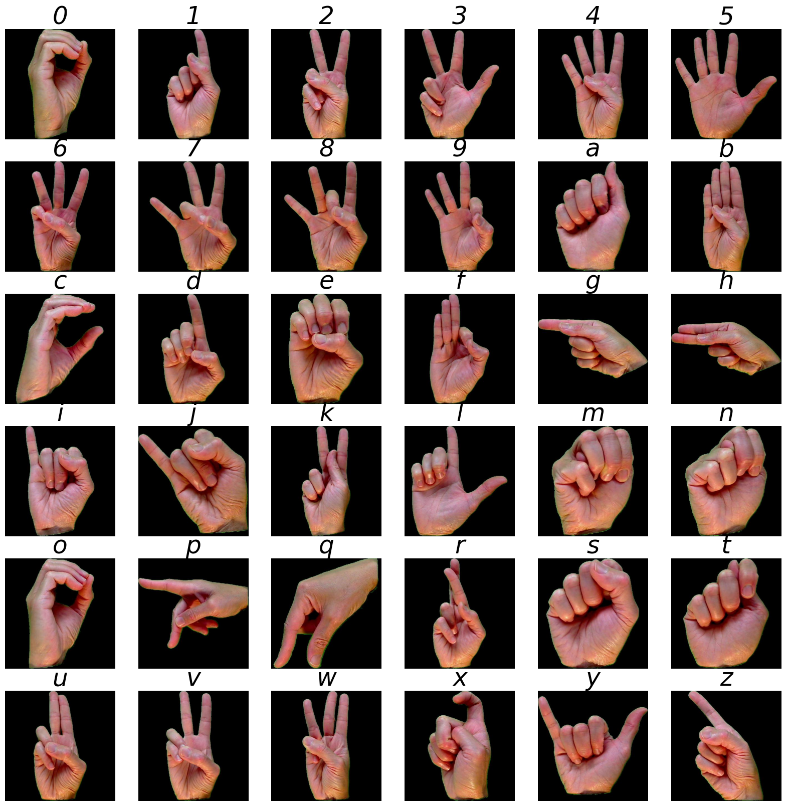

# Sign Language Detection



## Clone

```bash
git clone https://github.com/datvodinh/sign-language-detection.git
cd sign-language-detection # IF NOT ALREADY IN
```

## Setup

```bash
source ./scripts/setup.sh
```

## Train

```bash
python -m dl_project.train --model resnet --batch_size 64
```

### Train all

```bash
python -m dl_project.train --model all --batch_size 64
```

## Help

```bash
python -m dl_project.train -h
```
